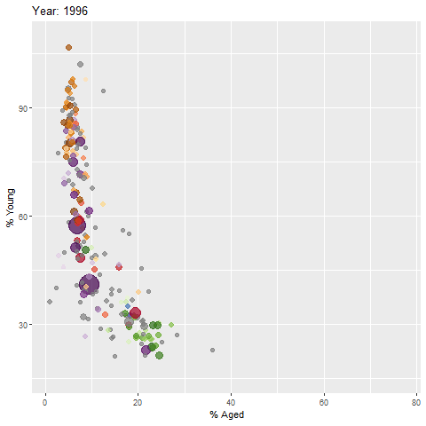

# **Getting Started**

### **Loading the R packages**

```{r}
pacman::p_load(readxl, gifski, gapminder,
               plotly, gganimate, tidyverse)
```

### **Importing the data**

```{r}
col <- c("Country", "Continent")
globalPop <- read_xls("data/GlobalPopulation.xls",
                      sheet="Data") %>%
  mutate_at(col, as.factor) %>%
  mutate(Year = as.integer(Year))
```

## **Animated Data Visualisation: gganimate methods**

### **Building a static population bubble plot**

```{r}
ggplot(globalPop, aes(x = Old, y = Young, 
                      size = Population, 
                      colour = Country)) +
  geom_point(alpha = 0.7, 
             show.legend = FALSE) +
  scale_colour_manual(values = country_colors) +
  scale_size(range = c(2, 12)) +
  labs(title = 'Year: {frame_time}', 
       x = '% Aged', 
       y = '% Young') 
```

### **Building the animated bubble plot**

```{r}
ggplot(globalPop, aes(x = Old, y = Young, 
                      size = Population, 
                      colour = Country)) +
  geom_point(alpha = 0.7, 
             show.legend = FALSE) +
  scale_colour_manual(values = country_colors) +
  scale_size(range = c(2, 12)) +
  labs(title = 'Year: {frame_time}', 
       x = '% Aged', 
       y = '% Young') +
  transition_time(Year) +       
  ease_aes('linear')          
```



## **Animated Data Visualisation: plotly**

### **Building an animated bubble plot: method `ggplotly()`**

```{r}
gg <- ggplot(globalPop, 
       aes(x = Old, 
           y = Young, 
           size = Population, 
           colour = Country)) +
  geom_point(aes(size = Population,
                 frame = Year),
             alpha = 0.7, 
             show.legend = FALSE) +
  scale_colour_manual(values = country_colors) +
  scale_size(range = c(2, 12)) +
  labs(x = '% Aged', 
       y = '% Young')

ggplotly(gg)
```

```{r}
gg <- ggplot(globalPop, 
       aes(x = Old, 
           y = Young, 
           size = Population, 
           colour = Country)) +
  geom_point(aes(size = Population,
                 frame = Year),
             alpha = 0.7) +
  scale_colour_manual(values = country_colors) +
  scale_size(range = c(2, 12)) +
  labs(x = '% Aged', 
       y = '% Young') + 
  theme(legend.position='none')

ggplotly(gg)
```

### **Building an animated bubble plot: method `plot_ly()`**

```{r}
bp <- globalPop %>%
  plot_ly(x = ~Old, 
          y = ~Young, 
          size = ~Population, 
          color = ~Continent,
          sizes = c(2, 100),
          frame = ~Year, 
          text = ~Country, 
          hoverinfo = "text",
          type = 'scatter',
          mode = 'markers'
          ) %>%
  layout(showlegend = FALSE)
bp


```
