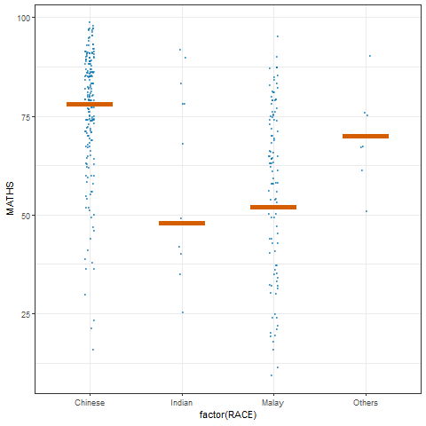

## **Getting Started**

### **Installing and loading the packages**

```{r}
pacman::p_load(plotly, crosstalk, DT, 
               ggdist, ggridges, colorspace,
               gganimate, tidyverse)
```

### **Data import**

```{r}
exam <- read_csv("data/Exam_data.csv")
```

## **Visualizing the uncertainty of point estimates: ggplot2 methods**

```{r}
my_sum <- exam %>%
  group_by(RACE) %>%
  summarise(
    n=n(),
    mean=mean(MATHS),
    sd=sd(MATHS)
    ) %>%
  mutate(se=sd/sqrt(n-1))
```

```{r}
knitr::kable(head(my_sum), format = 'html')
```

### **Plotting standard error bars of point estimates**

```{r}
ggplot(my_sum) +
  geom_errorbar(
    aes(x=RACE, 
        ymin=mean-se, 
        ymax=mean+se), 
    width=0.2, 
    colour="black", 
    alpha=0.9, 
    linewidth=0.5) +
  geom_point(aes
           (x=RACE, 
            y=mean), 
           stat="identity", 
           color="red",
           size = 1.5,
           alpha=1) +
  ggtitle("Standard error of mean maths score by rac")
```

### **Plotting confidence interval of point estimates**

```{r}
ggplot(my_sum) +
  geom_errorbar(
    aes(x=reorder(RACE, -mean), 
        ymin=mean-1.96*se, 
        ymax=mean+1.96*se), 
    width=0.2, 
    colour="black", 
    alpha=0.9, 
    linewidth=0.5) +
  geom_point(aes
           (x=RACE, 
            y=mean), 
           stat="identity", 
           color="red",
           size = 1.5,
           alpha=1) +
  labs(x = "Maths score",
       title = "95% confidence interval of mean maths score by race")
```

### **Visualizing the uncertainty of point estimates with interactive error bars**

```{r}
shared_df = SharedData$new(my_sum)

bscols(widths = c(4,8),
       ggplotly((ggplot(shared_df) +
                   geom_errorbar(aes(
                     x=reorder(RACE, -mean),
                     ymin=mean-2.58*se, 
                     ymax=mean+2.58*se), 
                     width=0.2, 
                     colour="black", 
                     alpha=0.9, 
                     size=0.5) +
                   geom_point(aes(
                     x=RACE, 
                     y=mean, 
                     text = paste("Race:", `RACE`, 
                                  "<br>N:", `n`,
                                  "<br>Avg. Scores:", round(mean, digits = 2),
                                  "<br>95% CI:[", 
                                  round((mean-2.58*se), digits = 2), ",",
                                  round((mean+2.58*se), digits = 2),"]")),
                     stat="identity", 
                     color="red", 
                     size = 1.5, 
                     alpha=1) + 
                   xlab("Race") + 
                   ylab("Average Scores") + 
                   theme_minimal() + 
                   theme(axis.text.x = element_text(
                     angle = 45, vjust = 0.5, hjust=1)) +
                   ggtitle("99% Confidence interval of average /<br>maths scores by race")), 
                tooltip = "text"), 
       DT::datatable(shared_df, 
                     rownames = FALSE, 
                     class="compact", 
                     width="100%", 
                     options = list(pageLength = 10,
                                    scrollX=T), 
                     colnames = c("No. of pupils", 
                                  "Avg Scores",
                                  "Std Dev",
                                  "Std Error")) %>%
         formatRound(columns=c('mean', 'sd', 'se'),
                     digits=2))
```

### **Visualizing the uncertainty of point estimates: ggdist methods**

```{r}
exam %>%
  ggplot(aes(x = RACE, 
             y = MATHS)) +
  stat_pointinterval() +
  labs(
    title = "Visualising confidence intervals of mean math score",
    subtitle = "Mean Point + Multiple-interval plot")
```

```{r}
  exam %>%
  ggplot(aes(x = RACE, y = MATHS)) +
  stat_pointinterval(.width = 0.95,
  .point = median,
  .interval = qi) +
  labs(
    title = "Visualising confidence intervals of median math score",
    subtitle = "Median Point + Multiple-interval plot")
```

### **Visualizing the uncertainty of point estimates: ggdist methods**

```{r}
exam %>%
  ggplot(aes(x = RACE, 
             y = MATHS)) +
  stat_pointinterval(
    show.legend = FALSE) +   
  labs(
    title = "Visualising confidence intervals of mean math score",
    subtitle = "Mean Point + Multiple-interval plot")
```

### **Visualizing the uncertainty of point estimates: ggdist methods**

```{r}
exam %>%
  ggplot(aes(x = RACE, 
             y = MATHS)) +
  stat_gradientinterval(   
    fill = "skyblue",      
    show.legend = TRUE     
  ) +                        
  labs(
    title = "Visualising confidence intervals of mean math score",
    subtitle = "Gradient + interval plot")
```

## **Visualising Uncertainty with Hypothetical Outcome Plots (HOPs)**

### **Installing ungeviz package**

```{r}
devtools::install_github("wilkelab/ungeviz")
```

### **Launch the application in R**

```{r}
library(ungeviz)
```

### **Visualising Uncertainty with Hypothetical Outcome Plots (HOPs)**

```{r}
ggplot(data = exam, 
       (aes(x = factor(RACE), 
            y = MATHS))) +
  geom_point(position = position_jitter(
    height = 0.3, 
    width = 0.05), 
    size = 0.4, 
    color = "#0072B2", 
    alpha = 1/2) +
  geom_hpline(data = sampler(25, 
                             group = RACE), 
              height = 0.6, 
              color = "#D55E00") +
  theme_bw() + 
  transition_states(.draw, 1, 3)

```


